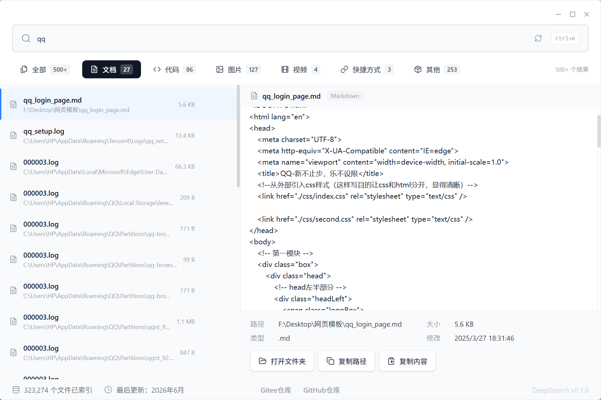
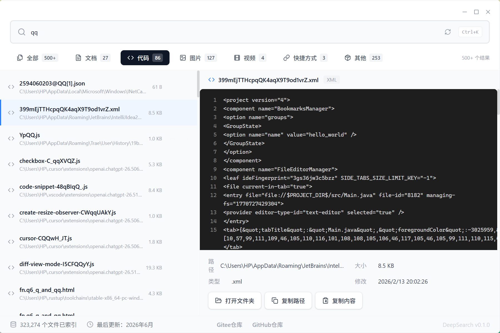

<div align="center">


# DeepSearch

**本地文件智能检索工具 -- 全离线 / 隐私安全 / 毫秒级响应**

[]()
[]()
[]()
[]()
[]()
[]()

</div>

---

## 项目简介

**DeepSearch** 是一款基于 [Tauri v2](https://v2.tauri.app/) 构建的本地文件检索桌面应用。它通过自动索引用户常用目录（桌面、文档、下载等）中的文件元数据，实现快速的本地文件搜索体验。

与在线搜索工具不同，DeepSearch 完全离线运行，所有数据仅存储在本地 SQLite 数据库中。无需联网、无需注册、无需上传任何文件信息。

### 核心特性

| 特性 | 说明 |
|:---:|:---|
| 隐私优先 | 全离线运行，数据不离开本机 |
| 快速响应 | SQLite WAL 模式 + 智能排序 |
| 全面覆盖 | 自动扫描用户目录 + 所有磁盘驱动器 |
| 多格式预览 | 支持文本、代码、PDF、DOCX、图片、视频预览 |
| 现代界面 | 无边框窗口 + 暗色主题 |

## 产品展示

### 搜索与预览

| 文档预览 | 代码预览 |
|:---:|:---:|
|  |  |

| 图片预览 | 视频预览 |
|:---:|:---:|
|  |  |

### 交互功能

| 复制路径提示 | 打开文件所在目录 |
|:---:|:---:|
|  |  |

---

## 核心功能

### 智能搜索

- **模糊匹配**：输入关键词即可搜索文件名和路径
- **智能排序**：文件名匹配优先于路径匹配，正常文件优先于特殊文件
- **实时反馈**：输入即搜，300ms 防抖优化
- **快捷键**：`Ctrl + K` 快速聚焦搜索框

### 分类筛选

支持按文件类型快速筛选：

| 筛选类别 | 包含类型 |
|:---:|:---|
| 文档 | PDF、DOCX、DOC、XLSX、XLS、PPTX、PPT、TXT、MD、CSV 等 |
| 代码 | JS、TS、PY、RS、GO、JAVA、CPP、HTML、CSS、JSON 等 |
| 图片 | PNG、JPG、JPEG、GIF、BMP、WEBP、SVG、ICO |
| 视频 | MP4、AVI、MKV、MOV、WMV、FLV、WEBM |
| 快捷方式 | LNK、URL |
| 其他 | 未归类的文件 |

### 文件预览

| 预览类型 | 支持格式 | 实现方式 |
|:---:|:---|:---|
| 纯文本 | TXT、LOG、INI、CFG、ENV、YAML、TOML、CSV 等 | 直接读取，截取前 5000 字符 |
| 代码 | JS、TS、PY、RS、GO、JAVA、CPP 等 | 纯文本显示 + 行号 |
| PDF 文档 | PDF | iframe + Blob URL 渲染 |
| Word 文档 | DOCX | Mammoth.js 解析转 HTML |
| 旧版 Word | DOC | 仅纯文本 .doc 可预览，二进制 .doc 需转换为 .docx |
| 图片 | PNG、JPG、GIF、BMP、WEBP、SVG、ICO | 内联 base64 显示 |
| 视频 | MP4、AVI、MKV、MOV、WMV、FLV、WEBM | HTML5 Video |

> 注意：代码预览以纯文本加行号方式展示，不包含语法高亮着色。XLSX/XLS 和 PPTX/PPT 文件当前仅支持索引和搜索，不支持内容预览。

### 文件操作

- **打开文件**：使用系统默认应用打开
- **打开所在目录**：在资源管理器中定位文件
- **复制路径**：复制完整文件路径到剪贴板
- **复制内容**：复制文本/代码预览内容到剪贴板

### 其他特性

- **启动画面**：应用启动时显示品牌动画
- **首次运行向导**：新用户引导流程
- **Toast 通知**：操作反馈提示
- **自动索引**：启动时自动扫描常用目录
- **自定义窗口**：无边框设计，支持最小化/最大化/关闭
- **系统托盘**：关闭窗口时可选择最小化至系统托盘，托盘图标支持左键唤起和右键菜单
- **全局快捷键**：`Shift + Enter` 随时唤起主窗口（支持最小化和隐藏状态）
- **唤起动画**：从托盘或最小化唤起时显示底部弹出动画
- **关闭对话框**：点击关闭时可选择退出或最小化至托盘，支持"不再提示"选项

---

## 支持的文件格式

### 文档格式

| 格式 | 扩展名 | 预览支持 |
|:---|:---|:---:|
| PDF 文档 | `.pdf` | 是 |
| Word 文档 | `.docx` | 是 |
| 旧版 Word | `.doc` | 仅纯文本 |
| 纯文本 | `.txt`, `.log`, `.ini`, `.cfg`, `.env` | 是 |
| Markdown | `.md` | 是 |
| CSV 数据 | `.csv` | 是 |
| Excel 表格 | `.xlsx`, `.xls` | 仅索引 |
| PowerPoint 演示 | `.pptx`, `.ppt` | 仅索引 |

### 代码格式

| 格式 | 扩展名 | 预览支持 |
|:---|:---|:---:|
| JavaScript | `.js`, `.jsx`, `.mjs`, `.cjs` | 是 |
| TypeScript | `.ts`, `.tsx` | 是 |
| Python | `.py`, `.pyw`, `.pyi` | 是 |
| Rust | `.rs` | 是 |
| Go | `.go` | 是 |
| Java | `.java` | 是 |
| C/C++ | `.c`, `.cpp`, `.cc`, `.cxx`, `.h`, `.hpp` | 是 |
| C# | `.cs` | 仅索引 |
| Web | `.html`, `.htm`, `.css`, `.scss`, `.less` | 是 |
| 数据格式 | `.json`, `.xml`, `.yaml`, `.yml`, `.toml` | 是 |
| 脚本 | `.sh`, `.bash`, `.ps1`, `.bat`, `.cmd` | 是 |
| SQL | `.sql` | 是 |
| 其他 | `.r`, `.lua`, `.vue`, `.svelte`, `.astro`, `.graphql` | 是 |

### 图片格式

| 格式 | 扩展名 | 预览支持 |
|:---|:---|:---:|
| 常规图片 | `.png`, `.jpg`, `.jpeg`, `.gif`, `.bmp` | 是 |
| 现代格式 | `.webp` | 是 |
| 矢量图 | `.svg` | 是 |
| 图标 | `.ico` | 是 |
| TIFF | `.tiff`, `.tif` | 是 |

### 视频格式

| 格式 | 扩展名 | 预览支持 |
|:---|:---|:---:|
| 常见格式 | `.mp4`, `.webm` | 是 |
| 其他格式 | `.avi`, `.mkv`, `.mov`, `.wmv`, `.flv`, `.m4v`, `.3gp`, `.mpg`, `.mpeg` | 是 |

---

## 系统要求

| 项目 | 最低要求 | 推荐配置 |
|:---|:---|:---|
| 操作系统 | Windows 10 (x64) | Windows 11 (x64) |
| 架构 | x64 | x64 |
| 内存 | 4 GB RAM | 8 GB RAM |
| 磁盘空间 | 100 MB（应用） | 500 MB+（含数据库） |
| 运行时 | WebView2（自动安装） | 最新版本 |

DeepSearch 仅支持 64 位 Windows 系统。首次运行时会自动安装 WebView2 运行时。

---

## 安装指南

### 方式一：NSIS 安装程序（推荐）

1. 从 [Releases](https://gitee.com/pure_full_of_smile/DeepSearch/releases) 页面下载 `DeepSearch_x.x.x_x64-setup.exe`
2. 双击运行安装程序
3. 选择安装路径（默认：`C:\Program Files\DeepSearch`）
4. 等待安装完成
5. 从开始菜单或桌面快捷方式启动 DeepSearch

NSIS 安装程序支持静默安装：`DeepSearch_x.x.x_x64-setup.exe /S`

### 方式二：MSI 安装程序

1. 下载 `DeepSearch_x.x.x_x64_en-US.msi`
2. 双击运行，按照向导完成安装
3. 启动 DeepSearch

MSI 安装程序支持企业批量部署：`msiexec /i DeepSearch_x.x.x_x64_en-US.msi /qn`

### 卸载

- 控制面板 > 程序和功能 > DeepSearch > 卸载
- 或使用开始菜单中的卸载快捷方式

---

## 使用教程

### 启动应用

首次启动时，DeepSearch 会显示启动画面，随后进入首次运行向导：

```
启动画面 -> 首次运行向导 -> 主界面
```

向导会介绍应用的核心功能，完成后自动开始索引文件。

### 搜索文件

1. 在顶部搜索框中输入关键词
2. 结果实时显示在左侧面板
3. 点击任意结果查看预览

快捷键：
- `Ctrl + K`：快速聚焦搜索框
- `Enter`：执行搜索
- `Esc`：清空搜索

### 筛选结果

使用搜索框下方的分类标签筛选结果：

```
全部 | 文档 | 代码 | 图片 | 视频 | 快捷方式 | 其他
```

### 预览文件

点击搜索结果即可在右侧面板预览文件内容：

- **文本/代码**：显示文件内容（前 5000 字符），代码带行号
- **PDF**：通过 iframe 渲染
- **DOCX**：Mammoth.js 解析后以 HTML 展示
- **图片**：base64 内联显示
- **视频**：HTML5 Video 播放器

### 文件操作

右键点击搜索结果或使用操作按钮：

| 操作 | 说明 |
|:---|:---|
| 打开文件 | 使用系统默认应用打开 |
| 打开目录 | 在资源管理器中显示文件 |
| 复制路径 | 复制完整路径到剪贴板 |
| 复制内容 | 复制预览中的文本内容 |

---

## 技术架构

### 系统架构图

```
+-----------------------------------------------------------------+
|                        DeepSearch 架构                          |
+-----------------------------------------------------------------+
|                                                                 |
|  +-----------------------------------------------------------+  |
|  |                    前端层 (Frontend)                        |  |
|  |                                                           |  |
|  |  App.tsx           -- 根组件，3阶段流程控制                   |  |
|  |    |                                                      |  |
|  |    +-- SplashScreen.tsx    启动画面动画                     |  |
|  |    +-- FirstRunWizard.tsx  首次运行向导                     |  |
|  |    +-- SearchBar.tsx       搜索输入 (300ms防抖, Ctrl+K)     |  |
|  |    +-- FilterBar.tsx       文件类型筛选标签                   |  |
|  |    +-- ResultList.tsx      搜索结果列表                     |  |
|  |    +-- PreviewPanel.tsx    多格式预览 (452行)               |  |
|  |    +-- StatusBar.tsx       索引状态显示                     |  |
|  |                                                           |  |
|  |  hooks/useSearch.ts       Tauri IPC 调用封装                |  |
|  |  types/index.ts           TypeScript 类型定义               |  |
|  |  styles/globals.css       全局样式                         |  |
|  +----------------------------+------------------------------+  |
|                               |                                 |
|                          Tauri IPC                               |
|                          invoke()                                |
|                               |                                 |
|  +----------------------------v------------------------------+  |
|  |                    命令层 (Commands)                       |  |
|  |                                                           |  |
|  |  commands/search.rs    search_query()  LIKE模糊查询        |  |
|  |  commands/index.rs     create_index()  创建/重建索引        |  |
|  |  commands/preview.rs   preview_file()  多格式文件预览       |  |
|  |  commands/config.rs    打开文件/复制路径                     |  |
|  +----------------------------+------------------------------+  |
|                               |                                 |
|  +----------------------------v------------------------------+  |
|  |                     核心层 (Core)                          |  |
|  |                                                           |  |
|  |  core/index_manager.rs                                    |  |
|  |    +-- get_all_scan_dirs()   目录发现 (中英双语)            |  |
|  |    +-- index_directory()     批量扫描 + 事务插入            |  |
|  |    +-- collect_files()       walkdir遍历 (max_depth=5)     |  |
|  |    +-- insert_file()         单文件元数据入库               |  |
|  +----------------------------+------------------------------+  |
|                               |                                 |
|  +----------------------------v------------------------------+  |
|  |                  基础设施层 (Infrastructure)                |  |
|  |                                                           |  |
|  |  db/mod.rs             Database 结构体                     |  |
|  |    +-- WAL 模式写入                                        |  |
|  |    +-- 64MB 缓存                                           |  |
|  |    +-- Mutex<Connection> 线程安全                          |  |
|  |                                                           |  |
|  |  db/schema.sql         files 表结构定义                    |  |
|  |                                                           |  |
|  |  外部依赖:                                                  |  |
|  |    rusqlite 0.32.x     SQLite 绑定                        |  |
|  |    walkdir 2.x         递归目录遍历                        |  |
|  |    tokio 1.x           异步运行时                          |  |
|  |    serde 1.x           序列化/反序列化                      |  |
|  |    tracing 0.1.x       结构化日志                          |  |
|  |    base64              二进制文件编码                       |  |
|  |    dirs                系统目录发现                         |  |
|  |    winreg              Windows 注册表读取                   |  |
|  +-----------------------------------------------------------+  |
|                                                                 |
+-----------------------------------------------------------------+
```

### 数据流

#### 搜索查询流程

```
用户输入关键词
    |
    v
SearchBar.tsx (300ms防抖)
    |
    v
useSearch.ts -> Tauri IPC invoke("search_query")
    |
    v
commands/search.rs
    |
    v
db/mod.rs -> SQLite SELECT WHERE name LIKE '%keyword%'
    |
    v
智能排序: 文件名匹配 > 路径匹配, 正常文件 > 特殊文件
    |
    v
SearchResponse { results[], total }
    |
    v
ResultList.tsx 渲染列表 -> 用户点击 -> invoke("preview_file")
    |
    v
commands/preview.rs 根据扩展名判断类型
    |
    +-- text/code -> read_text_content() 截取前5000字节
    +-- pdf/docx/image/video -> std::fs::read() -> base64编码
    |
    v
PreviewPanel.tsx 按类型渲染
```

#### 文件索引流程

```
lib.rs 应用启动
    |
    v
2秒延迟 (避免影响启动速度)
    |
    v
std::thread::spawn 后台线程
    |
    v
get_all_scan_dirs()
    |
    +-- dirs::home_dir() / USERPROFILE 环境变量
    +-- 遍历 Desktop/桌面, Documents/文档, Downloads/下载,
    |   Pictures/图片, Music/音乐, Videos/视频
    +-- 检查 OneDrive 同步目录
    +-- 读取 Windows 注册表 Shell Folders
    |
    v
index_directory()
    |
    v
collect_files() -- walkdir 遍历, max_depth=5
    |
    +-- 跳过: .git, node_modules, target, Windows,
    |   Program Files, AppData 等16个目录
    +-- 仅索引: INDEXABLE_EXTS 中的扩展名 + 无扩展名文件
    |
    v
批量插入 SQLite (100条/事务, BEGIN/COMMIT)
    |
    v
IndexProgress { total, indexed, skipped }
    |
    v
通知前端更新状态
```

### 数据库结构

```sql
CREATE TABLE IF NOT EXISTS files (
    id          INTEGER PRIMARY KEY AUTOINCREMENT,
    path        TEXT NOT NULL UNIQUE,    -- 完整文件路径
    name        TEXT NOT NULL,           -- 文件名
    ext         TEXT NOT NULL DEFAULT '', -- 小写扩展名
    size        INTEGER NOT NULL DEFAULT 0, -- 文件大小(字节)
    modified_at INTEGER NOT NULL DEFAULT 0  -- 修改时间(Unix时间戳)
);
```

### 技术栈

#### 前端

| 技术 | 版本 | 用途 |
|:---|:---|:---|
| React | 18.3.x | UI 框架 |
| TypeScript | 5.6.x | 类型系统 |
| Vite | 6.x | 构建工具 + 开发服务器 |
| TailwindCSS | 4.x | 原子化 CSS |
| lucide-react | 0.460.x | 图标库 |
| Mammoth.js | 1.12.x | DOCX 文档解析 |
| pdf.js | 6.0.x | PDF 文档渲染 |

#### 后端

| 技术 | 版本 | 用途 |
|:---|:---|:---|
| Tauri | 2.x | 桌面应用框架 |
| Rust | 2021 Edition | 系统编程语言 |
| SQLite | rusqlite 0.32.x | 本地数据库 (WAL 模式) |
| walkdir | 2.x | 递归目录遍历 |
| tokio | 1.x | 异步运行时 |
| serde | 1.x | 序列化/反序列化 |
| tracing | 0.1.x | 结构化日志 |

#### Tauri 插件

| 插件 | 用途 |
|:---|:---|
| `tauri-plugin-shell` | Shell 命令执行 |
| `tauri-plugin-dialog` | 原生文件/目录对话框 |
| `tauri-plugin-store` | 持久化键值存储 |

---

## 项目结构

```
localsearch-pro/
|-- package.json                    # npm 配置
|-- vite.config.ts                  # Vite 构建配置
|-- tsconfig.json                   # TypeScript 配置
|-- index.html                      # HTML 入口 (透明背景)
|
|-- src/                            # 前端源码
|   |-- main.tsx                    # React 入口
|   |-- App.tsx                     # 根组件
|   |                               #   3阶段: 启动画面 -> 向导 -> 主界面
|   |                               #   自定义标题栏 (无边框窗口)
|   |                               #   布局: 搜索栏 + 筛选栏 + 结果列表(40%) + 预览面板(60%)
|   |
|   |-- components/
|   |   |-- SearchBar.tsx           # 搜索输入框 (防抖、Ctrl+K)
|   |   |-- ResultList.tsx          # 搜索结果列表
|   |   |-- PreviewPanel.tsx        # 多格式预览面板 (452行)
|   |   |-- FilterBar.tsx           # 文件类型筛选标签
|   |   |-- StatusBar.tsx           # 索引状态栏
|   |   |-- SplashScreen.tsx        # 启动画面
|   |   |-- FirstRunWizard.tsx      # 首次运行向导
|   |
|   |-- hooks/
|   |   |-- useSearch.ts            # Tauri IPC 封装 Hook
|   |
|   |-- types/
|   |   |-- index.ts                # TypeScript 类型定义
|   |
|   |-- styles/
|       |-- globals.css             # 全局样式 + 代码块样式
|
|-- src-tauri/                      # 后端源码
    |-- Cargo.toml                  # Rust 依赖配置
    |-- tauri.conf.json             # Tauri 应用配置
    |-- build.rs                    # 构建脚本
    |-- app.manifest                # Windows 清单文件
    |
    |-- src/
    |   |-- main.rs                 # Rust 入口
    |   |-- lib.rs                  # Tauri 应用初始化
    |   |                           #   日志初始化、插件注册
    |   |                           #   数据库初始化 (带回退路径)
    |   |                           #   自动索引 (2秒延迟)
    |   |                           #   8个命令注册
    |   |
    |   |-- commands/
    |   |   |-- mod.rs              # 模块导出
    |   |   |-- search.rs           # 搜索命令 (LIKE查询)
    |   |   |-- index.rs            # 索引命令 (创建/重建/状态)
    |   |   |-- preview.rs          # 预览命令 (多格式读取)
    |   |   |-- config.rs           # 配置命令 (打开/复制)
    |   |
    |   |-- core/
    |   |   |-- mod.rs
    |   |   |-- index_manager.rs    # 索引管理器 (330行)
    |   |                           #   中英双语目录发现
    |   |                           #   walkdir 遍历 (max_depth=5)
    |   |                           #   事务批量插入 (100条/批)
    |   |
    |   |-- db/
    |       |-- mod.rs              # Database 结构体 (WAL + 64MB缓存)
    |       |-- schema.sql          # 数据库表结构
    |
    |-- icons/                      # 应用图标
    |   |-- 32x32.png
    |   |-- 128x128.png
    |   |-- 128x128@2x.png
    |   |-- icon.ico
    |   |-- icon.icns
    |   |-- icon.png
    |
    |-- capabilities/               # Tauri 权限配置
        |-- default.json
```

---

## 开发指南

### 环境准备

| 工具 | 版本要求 | 说明 |
|:---|:---|:---|
| Node.js | 18+ | JavaScript 运行时 |
| npm | 9+ | 包管理器 |
| Rust | 1.70+ | 系统编程语言 |
| Visual Studio Build Tools | 2019+ | C++ 编译工具链 |

#### 安装 Rust

```bash
# Windows (使用 rustup)
winget install Rustlang.Rustup

# 或访问 https://rustup.rs/ 下载安装
```

#### 安装 Visual Studio Build Tools

```bash
# 下载 Visual Studio Build Tools 2022
# https://visualstudio.microsoft.com/visual-cpp-build-tools/

# 安装时选择 "C++ 桌面开发" 工作负载
```

### 快速开始

```bash
# 1. 克隆项目
git clone https://gitee.com/pure_full_of_smile/DeepSearch.git
cd DeepSearch

# 2. 安装前端依赖
npm install

# 3. 启动开发模式
npm run tauri dev
```

### 开发命令

| 命令 | 说明 |
|:---|:---|
| `npm install` | 安装前端依赖 |
| `npm run dev` | 启动 Vite 开发服务器 |
| `npm run tauri dev` | 启动完整 Tauri 开发环境 (前端 + 后端) |
| `npm run tauri build` | 构建生产版本安装程序 |

### 构建产物

构建完成后，安装程序位于：

```
src-tauri/target/release/bundle/
|-- nsis/
|   +-- DeepSearch_x.x.x_x64-setup.exe    # NSIS 安装程序
+-- msi/
    +-- DeepSearch_x.x.x_x64_en-US.msi    # MSI 安装程序
```

---

## 自动索引范围

DeepSearch 在启动时会自动扫描以下目录：

### 用户目录

| 目录 | 说明 |
|:---|:---|
| `~/Desktop` 或 `~/桌面` | 桌面 |
| `~/Documents` 或 `~/文档` | 文档 |
| `~/Downloads` 或 `~/下载` | 下载 |
| `~/Pictures` 或 `~/图片` | 图片 |
| `~/Music` 或 `~/音乐` | 音乐 |
| `~/Videos` 或 `~/视频` | 视频 |

自动识别中文和英文两种系统语言下的目录名称。同时检查 OneDrive 同步目录和 Windows 注册表中的 Shell Folder 路径。

### 系统驱动器

自动扫描所有可用的磁盘驱动器（C:\、D:\、E:\ 等）

### 索引配置

| 参数 | 值 |
|:---|:---|
| 最大遍历深度 | 5 层 |
| 跳过目录 | .git, node_modules, target, Windows, Program Files, AppData 等 16 个 |
| 批次大小 | 100 条/事务 |
| 启动延迟 | 2 秒 |

---

## 多语言目录支持

DeepSearch 自动识别操作系统语言，并扫描对应语言的用户目录。当前支持以下两种语言：

| 语言 | 桌面 | 文档 | 下载 | 图片 | 音乐 | 视频 |
|:---|:---|:---|:---|:---|:---|:---|
| 英语 | Desktop | Documents | Downloads | Pictures | Music | Videos |
| 中文 | 桌面 | 文档 | 下载 | 图片 | 音乐 | 视频 |

---

## 常见问题

### Q: DeepSearch 需要联网吗？

**A**: 不需要。DeepSearch 完全离线运行，所有数据存储在本地 SQLite 数据库中，不会上传任何文件信息。

### Q: 索引会占用多少磁盘空间？

**A**: 索引数据库大小取决于文件数量。一般情况下：
- 10,000 个文件 ≈ 1-2 MB
- 100,000 个文件 ≈ 10-20 MB
- 1,000,000 个文件 ≈ 100-200 MB

### Q: 索引速度如何？

**A**: 索引速度取决于磁盘性能和文件数量。首次索引可能需要几分钟，后续增量索引会更快。使用 SSD 硬盘可显著提升索引速度。

### Q: 如何手动触发重新索引？

**A**: 点击搜索框右侧的刷新按钮重新构建索引。

### Q: 支持哪些 Windows 版本？

**A**: DeepSearch 支持 Windows 10 (x64) 及以上版本，包括 Windows 11。需要 WebView2 运行时（首次运行时自动安装）。

### Q: 文件索引会实时更新吗？

**A**: 当前版本在启动时自动索引，文件变更需要手动刷新索引。实时文件监听功能在后续版本中计划支持。

### Q: 为什么某些文件无法预览？

**A**: 预览能力取决于文件格式：
- DOCX 可以预览（通过 Mammoth.js），但旧版 .doc 格式需要先转换为 .docx
- XLSX/XLS 和 PPTX/PPT 当前仅支持索引和搜索，暂不支持内容预览
- 代码文件以纯文本加行号方式展示，不包含语法着色
- 二进制文件（exe、dll 等）仅支持索引，不支持预览

### Q: 如何卸载 DeepSearch？

**A**: 通过控制面板 > 程序和功能 > DeepSearch > 卸载，或使用开始菜单中的卸载快捷方式。

---

## 更新日志

### v0.1.0 (2026-05-30)

首个正式版本

#### 核心功能

- 自动索引用户目录和所有磁盘驱动器
- 基于 SQLite LIKE 的模糊搜索
- 智能排序（文件名匹配优先）
- 多格式文件预览（文本、代码、PDF、DOCX、图片、视频）
- 文件类型分类筛选
- 文件操作（打开、定位、复制路径、复制内容）

#### 界面特性

- Tauri v2 无边框窗口
- 自定义标题栏（最小化/最大化/关闭）
- 启动画面动画
- 首次运行向导
- Toast 通知系统
- 响应式布局

#### 技术实现

- React 18 + TypeScript + TailwindCSS 前端
- Rust + SQLite 后端
- WAL 模式数据库优化
- 批量事务插入（100条/批）
- 中英双语目录自动识别
- OneDrive 同步目录支持
- Windows 注册表 Shell Folder 读取

---

## 许可证

本项目基于 **MIT 许可证** 开源。

```
MIT License

Copyright (c) 2026 DeepSearch

Permission is hereby granted, free of charge, to any person obtaining a copy
of this software and associated documentation files (the "Software"), to deal
in the Software without restriction, including without limitation the rights
to use, copy, modify, merge, publish, distribute, sublicense, and/or sell
copies of the Software, and to permit persons to whom the Software is
furnished to do so, subject to the following conditions:

The above copyright notice and this permission notice shall be included in all
copies or substantial portions of the Software.

THE SOFTWARE IS PROVIDED "AS IS", WITHOUT WARRANTY OF ANY KIND, EXPRESS OR
IMPLIED, INCLUDING BUT NOT LIMITED TO THE WARRANTIES OF MERCHANTABILITY,
FITNESS FOR A PARTICULAR PURPOSE AND NONINFRINGEMENT. IN NO EVENT SHALL THE
AUTHORS OR COPYRIGHT HOLDERS BE LIABLE FOR ANY CLAIM, DAMAGES OR OTHER
LIABILITY, WHETHER IN AN ACTION OF CONTRACT, TORT OR OTHERWISE, ARISING FROM,
OUT OF OR IN CONNECTION WITH THE SOFTWARE OR THE USE OR OTHER DEALINGS IN THE
SOFTWARE.
```

---

## 联系方式

<div align="center">

[](https://gitee.com/pure_full_of_smile/DeepSearch)
[](https://github.com/WhisperCove/localsearch-pro)

如有问题或建议，欢迎提交 Issue 或 Pull Request

</div>

---

<div align="center">

**DeepSearch** -- 让本地文件搜索更简单、更快速、更安全

DeepSearch Team

</div>
